# River Flood Maximum Flow Modeling

## Overview

This project presents flood frequency analysis and maximum river discharge modeling using historical hydrological data.

The objective is to estimate design floods and return periods for water resources planning and infrastructure design.

## Study Area

Awash River Basin, Ethiopia

## Objectives

- Analyze annual maximum river discharge
- Estimate design floods
- Calculate return periods
- Support flood risk assessment

## Data

- Annual maximum river flow records
- Hydrological observations
- River discharge measurements

## Methods

### Data Processing

- Data cleaning
- Missing value checking
- Statistical summaries

### Flood Frequency Analysis

- Gumbel Distribution
- Return Period Analysis
- Extreme Value Analysis

### Visualization

- Flood Frequency Curves
- Return Period Charts
- Hydrographs

## Tools Used

- Python
- Pandas
- NumPy
- SciPy
- Matplotlib
- Excel
- GIS

## Outputs

- Design flood estimates
- Flood frequency curves
- Return period calculations
- Hydrological analysis report

# River Flood Maximum Flow Modeling

## Overview

This project presents hydrological flood frequency analysis and maximum flow modeling for a watershed in Oromia Region, Ethiopia.

The study integrates GIS, Remote Sensing, hydrological statistics, and flood frequency analysis to estimate peak flows, return periods, and flood risk patterns.

## Study Area

### Location Map

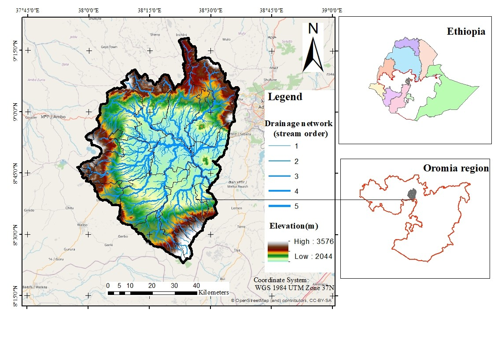

The watershed is located in Oromia Region, Ethiopia.

## Environmental Characteristics

### Agro-Climatic Zones

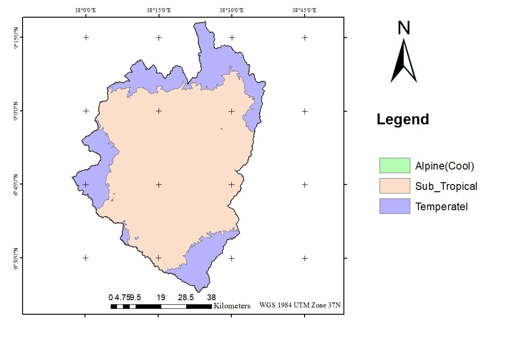

The watershed consists mainly of Sub-Tropical and Temperate climatic zones.

### Geology

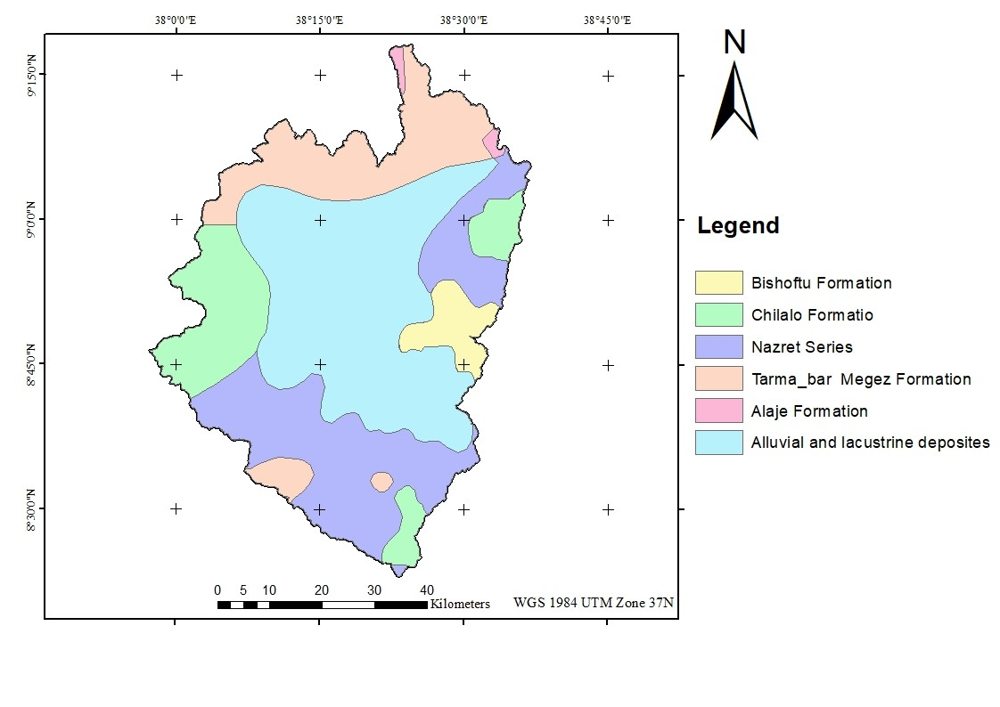

Major geological formations influencing runoff generation and groundwater interaction.

### Soil Types

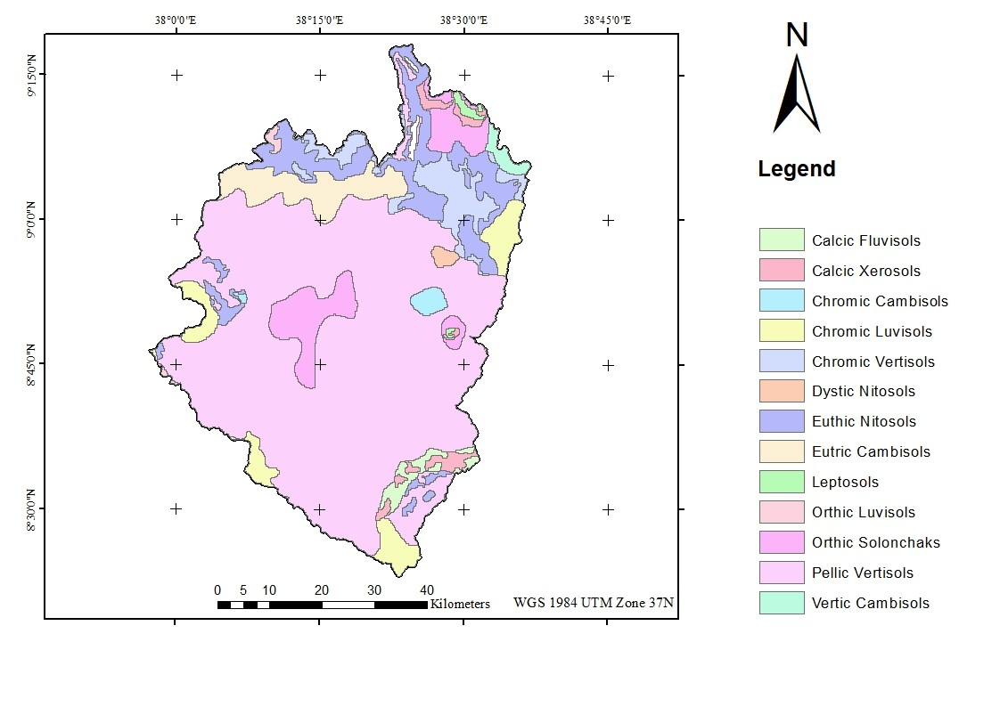

Spatial distribution of dominant soil groups within the watershed.

### Land Use / Land Cover

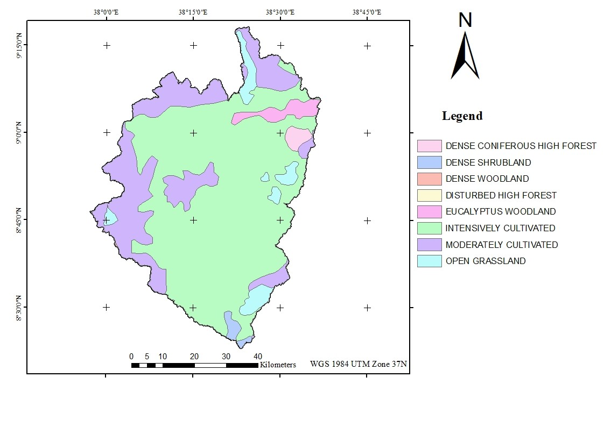

Land use characteristics affecting infiltration and runoff response.

### Mean Annual Rainfall Distribution

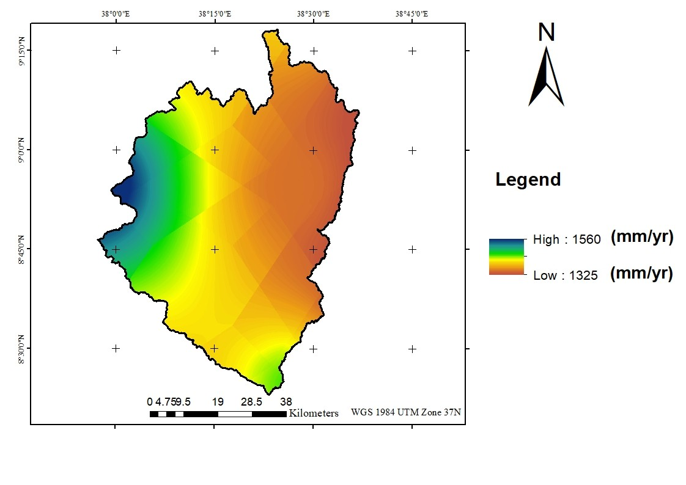

Spatial variation of precipitation across the watershed.

## Rainfall Analysis

### Long-Term Rainfall Trend

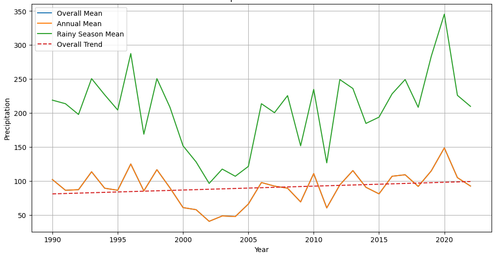

The watershed shows temporal variability in annual precipitation.

### Rainfall vs Flood Flow Relationship

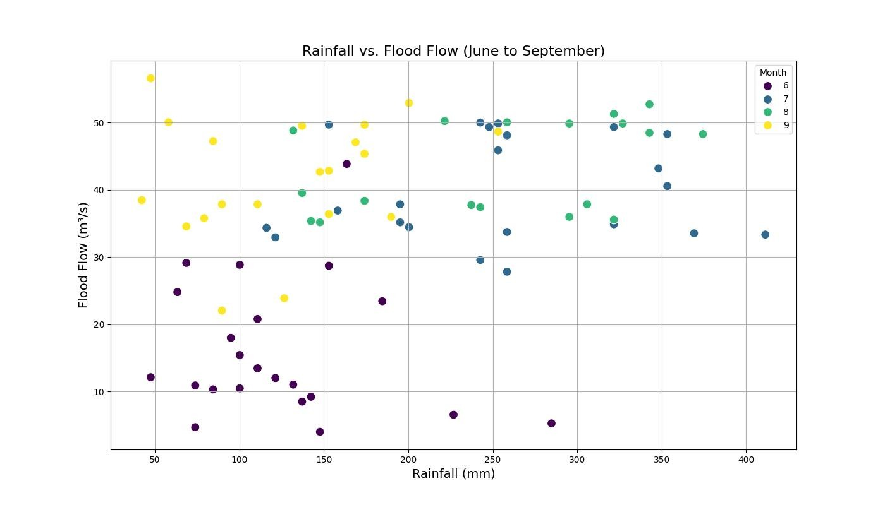

Relationship between seasonal rainfall and observed flood discharge.

## Flood Analysis

### Total Rainfall and Maximum Flood Flow Trends

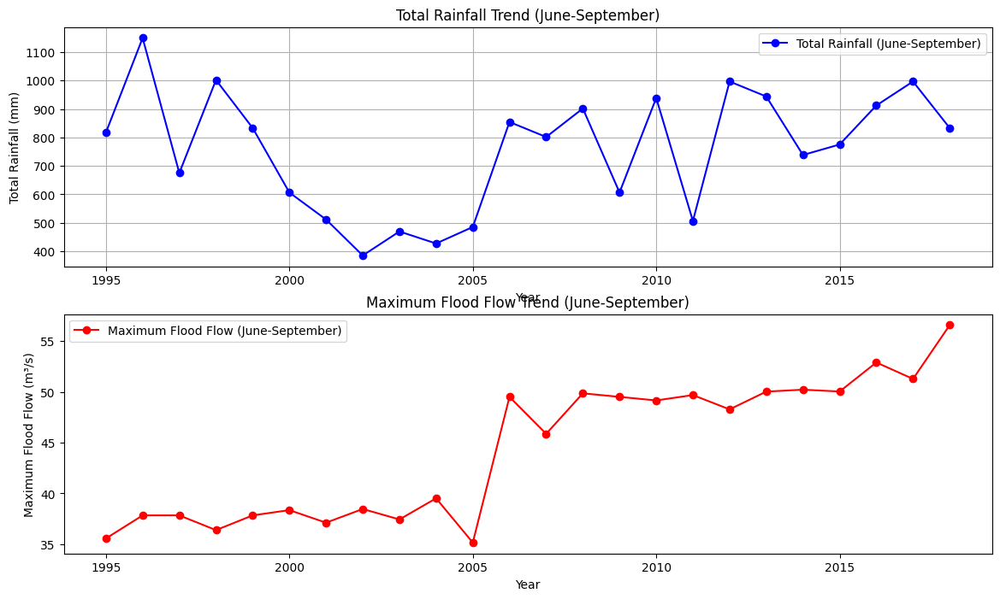

Comparison between seasonal rainfall and maximum flood discharge.

### Peak Flow Frequency Analysis

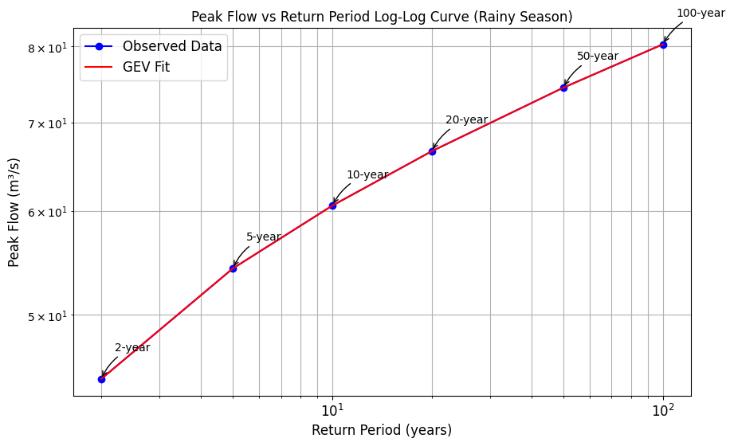

Estimated design floods for:

- 2-year return period
- 5-year return period
- 10-year return period
- 20-year return period
- 50-year return period
- 100-year return period

### Distribution Model Comparison

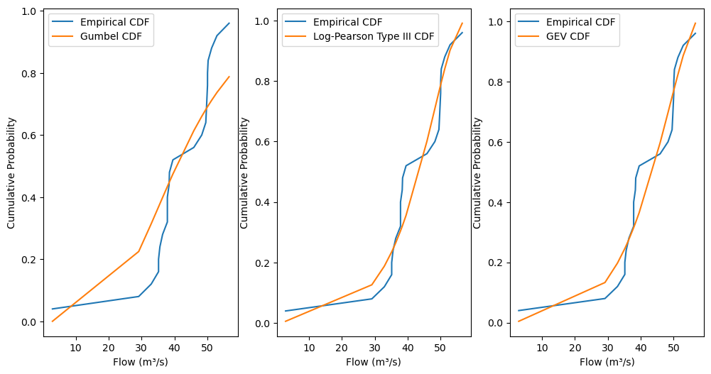

Comparison of:

- Gumbel Distribution
- Log Pearson Type III
- Generalized Extreme Value (GEV)

for flood frequency estimation.

### Flood Inundation Analysis

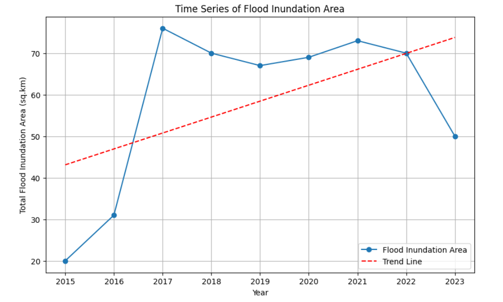

Time series analysis of flood inundation extent and temporal trends.

## Methods

### GIS Analysis

- Watershed delineation
- Stream network extraction
- DEM analysis
- Drainage density assessment

### Statistical Analysis

- Descriptive statistics
- Trend analysis
- Correlation analysis

### Flood Frequency Analysis

- Gumbel Distribution
- Log Pearson Type III
- Generalized Extreme Value (GEV)

### Visualization

- Hydrographs
- Frequency curves
- Rainfall trend plots
- Flood inundation analysis

## Software

- ArcGIS
- QGIS
- Python
- Pandas
- NumPy
- SciPy
- Matplotlib
- Excel

## Key Outputs

- Watershed characterization
- Rainfall trend analysis
- Flood frequency estimation
- Peak discharge modeling
- Return period estimation
- Flood risk assessment

## Author

Jifara Dabessa

MSc Remote Sensing and Geoinformatics
BSc Computer Science
Advanced Diploma Water Resources Engineering
